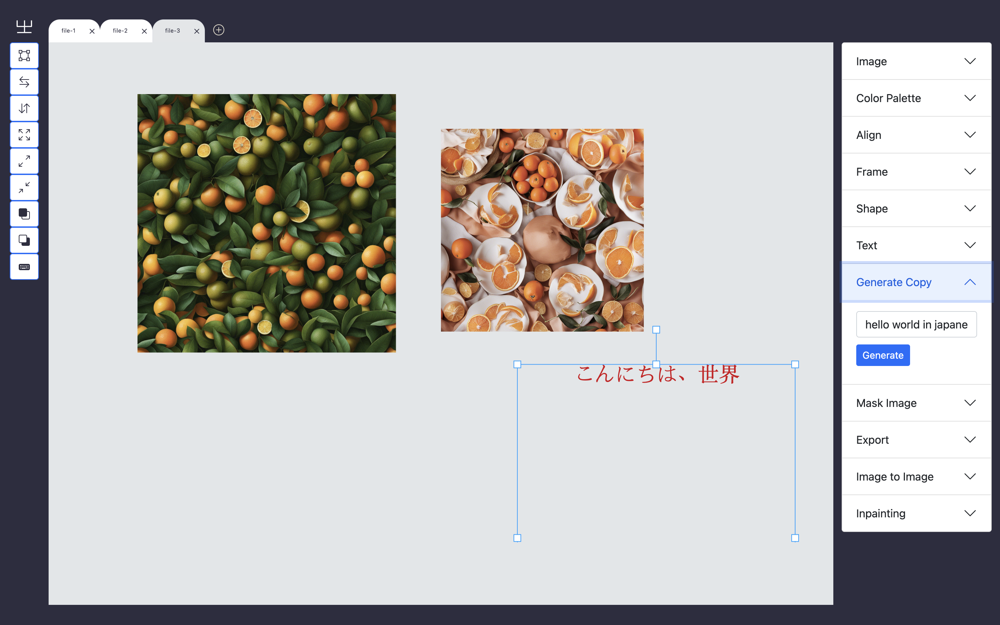
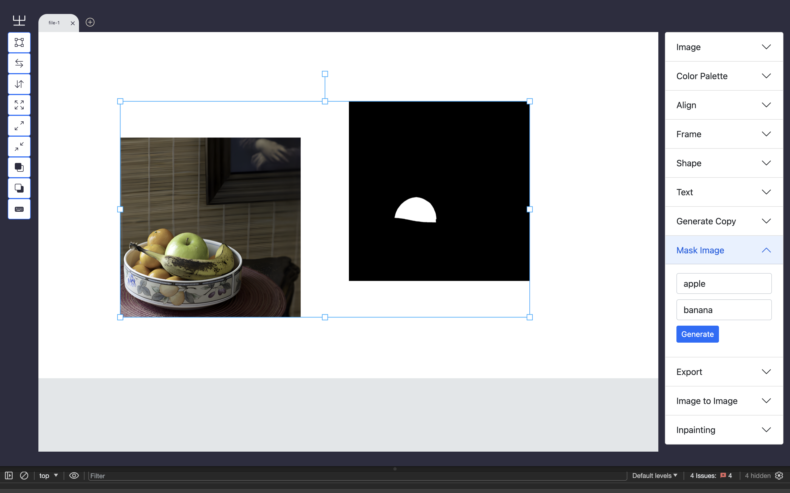
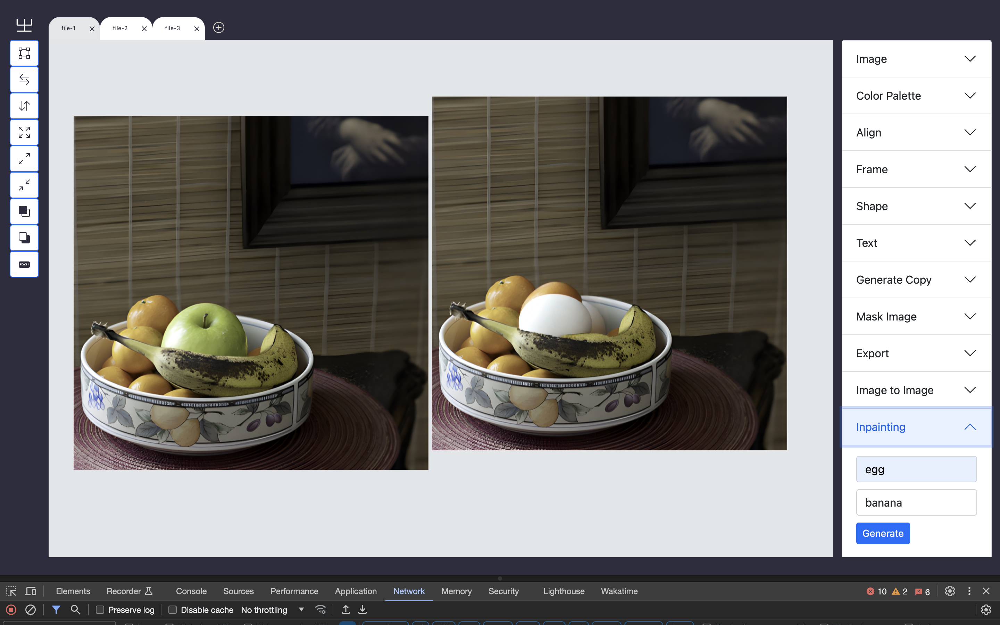

# Mirage 
Mirage is a browser-based interface design tool that is powered by Stability-AI and Fixie for generating images and texts.
Try out a [Demo](https://frontend.mirage.humanise.app/)

You can [Watch the loom demo](https://www.loom.com/share/d3d65cc1799b4322b572857fac6c0970?sid=a701975c-a8c0-4ff2-985d-135469fbdeba)


## ✨ Features

- Includes complete front-end and back-end code.
- Support deployment both locally and in the cloud.
- Fully based on open source and can be used for commercial purposes.
- Mask prompting based on Grounding DINO & Segment Anything.
- Image Generation with Stability API
- Image to Image

### Inpainting
To change an object in an Image, Grounded dino and Segment anything is used to segment and mask the object. Specify the object you want and the object you dont want and mask. Once you are done with masking, select both items and specify what you want to replace your masked image with. 

## 


## 📦 Installation

```bash
cd web
```
Once you have changed directory,install the packages

```bash
npm install # web

```
Start the server

```bash
npm run start # web

```

## ⌨️ Server setup

```bash
cd  server # web

```

```bash
pip install -r requirements.txt  # web

```
```
bash runserver.sh
```

## 🔗 Built with
- Stabilty AI
- Fixie
- FastAPI
- React

## Acknowledgement

[React Image Editor](https://github.com/swimmingkiim/react-image-editor): the codebase I built upon.